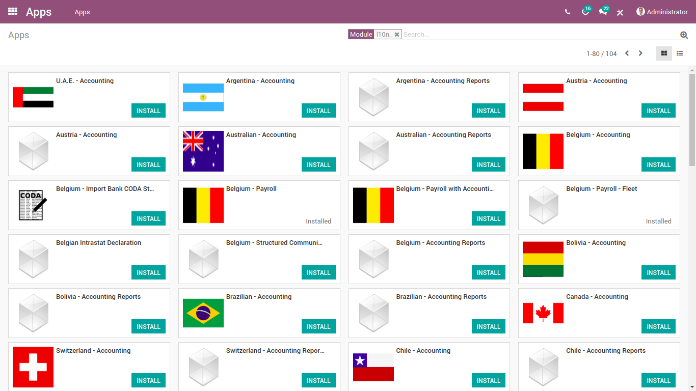

==========================
Making my Own Localization
==========================

.. note::
   xxxxxxxxxxxxxxxxxxxxxxxxxxxxxxxxxxxxxxxxxxxxxxx

Building a localization module
~~~~~~~~~~~~~~~~~~~~~~~~~~~~~~

A **Localization** module is an Odoo module containing all the necessary stuff to make Odoo suitable for a general purpose use in a particular country (e.g. Charts of accounts, Taxes, financial reports, etc).

The first step is to create a new Odoo module (see ??creating a module??) named **l10n_xx** where **xx** is the lower case country code, taken from https://en.wikipedia.org/wiki/ISO_3166-1_alpha-2.
Obviously, this newly created module must depends of ``account``.

There are two ways to install a **l10n_xx** module.

The first way is to install accounting while being certain that the right country is set on your company.
Then, the localization module corresponding to the country code of the company will be installed automatically.
This behavior is allowed by the ``_auto_install_l10n()`` method defined on ``account.__init__.py``.
In case of no country code set or no localization module found, the ``l10n_generic_coa`` (US) localization module will be installed by default.

.. code-block:: py

   # -*- coding: utf-8 -*-
   # Part of Odoo. See LICENSE file for full copyright and licensing details.
   {
       'name' : 'Invoicing',
       'version' : '1.1',
       'summary': 'Send Invoices and Track Payments',
       'sequence': 30,
       'description': """
   Core mechanisms for the accounting modules. To display the menuitems, install the module account_invoicing.
       """,
       'category': 'Accounting',
       'website': 'https://www.odoo.com/page/billing',
       'images' : ['images/accounts.jpeg','images/bank_statement.jpeg','images/cash_register.jpeg','images/chart_of_accounts.jpeg','images/customer_invoice.jpeg','images/journal_entries.jpeg'],
       'depends' : ['base_setup', 'product', 'analytic', 'web_planner', 'portal'],
       'data': [
           ...
       ],
       'demo': [
           ...
       ],
       'qweb': [
           ...
       ],
       'installable': True,
       'application': False,
       'auto_install': False,

        # The localization module is installed thanks to the below line
       'post_init_hook': '_auto_install_l10n',
   }

.. code-block:: py

    # -*- coding: utf-8 -*-
    # Part of Odoo. See LICENSE file for full copyright and licensing details.

    def _auto_install_l10n(cr, registry):
        # Search for a l10n_<country_code> localization module to install
        ...
        country_code = env.user.company_id.country_id.code
        if country_code:
            module_list = []
            ...
            if env['ir.module.module'].search([('name', '=', 'l10n_' + country_code.lower())]):
                module_list.append('l10n_' + country_code.lower())
            else:
                module_list.append('l10n_generic_coa')
            ...
            module_ids = env['ir.module.module'].search([('name', 'in', module_list), ('state', '=', 'uninstalled')])
            module_ids.sudo().button_install()

An alternative of this trick is to install directly the localization module you want by searching it directly in the ``apps`` module:

Configuring my own Chart of Accounts?
~~~~~~~~~~~~~~~~~~~~~~~~~~~~~~~~~~~~~

When the Chart of Accounts is installed, all its dependencies are too. It means all accounts, taxes and fiscal positions must be linked to this one.

So, the first step is to create an object representing your Chart of Accounts. This step is done using the ``account.chart.template`` model.

.. code-block:: xml

    <record id="..." model="account.chart.template">
        <!-- [Required] Specify the name to display for this CoA. -->
        <field name="name">...</field>

        <!-- [Required] Specify the currency. E.g. "base.USD". -->
        <field name="currency_id" ref="..."/>

        <!-- [Optional] Define a parent Chart of Accounts that will be installed just before this one. -->
        <field name="parent_id" ref="..."/>

        <!-- [Optional] Define the number of digits of account codes. By default, the value is 6. -->
        <field name="code_digits">...</field>

        <!-- [Optional] Boolean to show or not this CoA on the list. By default, the CoA is visible.
         This field is mostly used when this CoA has some children (see parent_id field). -->
        <field name="visible" eval="..."/>

        <!-- [Optional] Boolean to enable the Anglo-Saxon accounting. By default, this field is False. -->
        <field name="use_anglo_saxon" eval="..."/>

        <!-- [Optional] Boolean to enable the complete set of taxes. By default, this field is True.
        This boolean helps you to choose if you want to propose to the user to encode the sale and purchase rates or choose from list of taxes.
        This last choice assumes that the set of tax defined on this template is complete. -->
        <field name="complete_tax_set" eval="..."/>

        <!-- [Optional] Specify a prefix of the bank accounts. -->
        <field name="bank_account_code_prefix">...</field>

        <!-- [Optional] Specify a prefix of the cash accounts. -->
        <field name="cash_account_code_prefix">...</field>

        <!-- [Optional] Specify the spoken languages.
        /!\ This option is only available if your module depends of l10n_multilang.
        You must provide the language codes separated by ';', e.g. eval="'en_US;ar_EG;ar_SY'". -->
        <field name="spoken_languages" eval="..."/>
    </record>

For example, let's take a look to the Belgium Chart of Accounts.

.. code-block:: xml

    <record id="l10nbe_chart_template" model="account.chart.template">
        <field name="name">Belgian PCMN</field>
        <field name="currency_id" ref="base.EUR"/>
        <field name="bank_account_code_prefix">550</field>
        <field name="cash_account_code_prefix">570</field>
        <field name="spoken_languages" eval="'nl_BE'"/>
    </record>

Then, we can create each dependency of such record by setting the identifier of our newly created Chart of Accounts in the ``chart_template_id`` field.
The following sections show in details how to create these records.

Adding a new account to my Chart of Accounts
############################################

After you Chart of Accounts is created, you are able to create each account individually easily using the ``account.account.template`` model.

.. code-block:: xml

    <record id="..." model="account.account.template">
        <!-- [Required] Specify the name to display for this account. -->
        <field name="name">...</field>

        <!-- [Required] Specify a code. -->
        <field name="code">...</field>

        <!-- [Required] Specify a type. -->
        <field name="user_type_id">...</field>

        <!-- [Required] Set the CoA owning this account. -->
        <field name="chart_template_id" ref="..."/>

        <!-- [Optional] Specify a secondary currency for each account.move.line linked to this account. -->
        <field name="currency_id" ref="..."/>

        <!-- [Optional] Boolean to allow the user to reconcile entries in this account. True by default. -->
        <field name="reconcile" eval="..."/>

        <!-- [Optional] Specify a group for this account. -->
        <field name="group_id" ref="...">

        <!-- [Optional] Specify some tags. -->
        <field name="tag_ids" eval="...">
    </record>

Some of the described fields above deserve a bit more explanation.

First, the ``user_type_id`` field requires a value of type ``account.account.type``.
Although some additional types could be created in a localization module, we encourage the usage of the existing types in the `account/data/data_account_type.xml <https://github.com/odoo/odoo/blob/11.0/addons/account/data/data_account_type.xml>`_ file.
The usage of these generic types ensures the generic reports working correctly in addition to those that you could create in your localization module.

.. warning::

    * Avoid the usage of liquidity ``account.account.type``.
    * Only one account of type payable/receivable is enough.

Then, the ``group_id`` field ...

Although the ``tag_ids`` field is optional, this one remains a very powerful feature.
Indeed, this one allows you to define some tags for your accounts to spread them correctly on your reports.
For example, suppose you want to create a financial report having multiple lines but you have no way to find a rule to dispatch the accounts according their ``code`` or ``name``.
The solution is the usage of tags, one for each report line, to spread and aggregate your accounts like you want.

Like any other record, a tag can be created with the following xml structure:

.. code-block:: xml

    <record id="..." model="account.account.tag">
        <!-- [Required] Specify the name to display for this tag. -->
        <field name="name">...</field>

        <!-- [Optional] Define a scope for this applicability.
        The available keys are 'accounts' and 'taxes' but 'accounts' is the default value. -->
        <field name="applicability">...</field>
    </record>

As you can well imagine with the usage of tags, this feature can also be used with taxes.

.. warning::

    Don't create too much accounts: 200-300 is enough.

An examples coming from the ``l10n_be`` module:

.. code-block:: xml

        <record id="a4000" model="account.account.template">
            <field name="name">Clients</field>
            <field name="code">4000</field>
            <field name="user_type_id" ref="account.data_account_type_receivable"/>
            <field name="chart_template_id" ref="l10nbe_chart_template"/>
        </record>

Adding a new tax to my Chart of Accounts
########################################

To create a new tax record, you just need to follow the same process as the creation of accounts.
The only difference being that you must use the ``account.tax.template`` model:

.. code-block:: xml

    <record id="..." model="account.tax.template">
        <!-- [Required] Specify the name to display for this tax. -->
        <field name="name">...</field>

        <!-- [Required] Specify the amount.
        E.g. 7 with fixed amount_type means v + 7 if v is the amount on which the tax is applied.
         If amount_type is 'percent', the tax amount is v * 0.07. -->
        <field name="amount" eval="..."/>

        <!-- [Required] Set the CoA owning this tax. -->
        <field name="chart_template_id" ref="..."/>

        <!-- [Required/Optional] Define an account if the tax is not a group of taxes. -->
        <field name="account_id" ref="..."/>

        <!-- [Required/Optional] Define an refund account if the tax is not a group of taxes. -->
        <field name="refund_account_id" ref="..."/>

        <!-- [Optional] Define the tax's type.
        'sale', 'purchase' or 'none' are the allowed values. 'sale' is the default value.
        Note: 'none' means a tax can't be used by itself, however it can still be used in a group. -->
        <field name="type_tax_use">...</field>

        <!-- [Optional] . -->
        <field name="tax_adjustment" eval="..."/>

        <!-- [Optional] Define the type of amount:
        'group' for a group of taxes, 'fixed' for a tax with a fixed amount or 'percent' for a classic percentage of price.
        By default, the type of amount is percentage. -->
        <field name="amount_type" eval="..."/>

        <!-- [Optional] Define some children taxes.
        /!\ Should be used only with an amount_type with 'group' set. -->
        <field name="children_tax_ids" eval="..."/>

        <!-- [Optional] The sequence field is used to define order in which the tax lines are applied.
        By default, sequence = 1. -->
        <field name="sequence" eval="..."/>

        <!-- [Optional] Specify a short text to be displayed on invoices.
        For example, a tax named "15% on Services" can have the following label on invoice "15%". -->
        <field name="description">...</field>

        <!-- [Optional] Boolean that indicates if the amount should be considered as included in price. False by default.
        E.g. Suppose v = 132 and a tax amount of 20.
        If price_include = False, the computed amount will be 132 * 0.2 = 26.4.
        If price_include = True, the computed amount will be 132 - (132 / 1.2) = 132 - 110 = 22. -->
        <field name="price_include" eval="..."/>

        <!-- [Optional] Boolean to set to include the amount to the base. False by default.
         If True, the subsequent taxes will be computed based on the base tax amount plus the amount of this tax.
         E.g. suppose v = 100, t1, a tax of 10% and another tax t2 with 20%.
         If t1 doesn't affects the base,
         t1 amount = 100 * 0.1 = 10 and t2 amount = 100 * 0.2 = 20.
         If t1 affects the base,
         t1 amount = 100 * 0.1 = 10 and t2 amount = 110 * 0.2 = 22.  -->
        <field name="include_base_amount" eval="..."/>

        <!-- [Optional] Boolean false by default.
         If set, the amount computed by this tax will be assigned to the same analytic account as the invoice line (if any). -->
        <field name="analytic" eval="..."/>

        <!-- [Optional] Specify some tags.
        These tags must have 'taxes' as applicability.
        See the previous section for more details. -->
        <field name="tag_ids" eval="...">

        <!-- [Optional] Define a tax group. -->
        <field name="tax_group_id" ref="..."/>

        <!-- [Optional] Define the tax exigibility either based on invoice ('on_invoice' value) or
        either based on payment using the 'on_payment' key.
        The default value is 'on_invoice'. -->
        <field name="tax_exigibility">...</field>

        <!-- [Optional] Define a cash basis account in case of tax exigibility 'on_payment'. -->
        <field name="cash_basis_account" red="..."/>
    </record>

An example found in the ``l10n_pl`` module:

.. code-block:: xml

    <record id="vp_leas_sale" model="account.tax.template">
        <field name="chart_template_id" ref="pl_chart_template"/>
        <field name="name">VAT - leasing pojazdu(sale)</field>
        <field name="description">VLP</field>
        <field name="amount">1.00</field>
        <field name="sequence" eval="1"/>
        <field name="amount_type">group</field>
        <field name="type_tax_use">sale</field>
        <field name="children_tax_ids" eval="[(6, 0, [ref('vp_leas_sale_1'), ref('vp_leas_sale_2')])]"/>
        <field name="tag_ids" eval="[(6,0,[ref('l10n_pl.tag_pl_21')])]"/>
        <field name="tax_group_id" ref="tax_group_vat_23"/>
    </record>

Adding a new fiscal position to my Chart of Accounts
####################################################

To create a new fiscal position, simply use the ``account.fiscal.position.template`` model:

.. code-block:: xml

        <record id="l10n_xx_fiscal_position_xx" model="account.fiscal.position.template">
            <field name="name">...</field>
            <field name="chart_template_id" ref="..."/>
            <field name="note">...</field>
        </record>

.. seealso::

  :doc:`../others/taxes/application`

others/taxes/application.html

Adding the properties to my Chart of Accounts
#############################################

When the whole accounts are generated, you have the possibility to override the newly generated Chart of Accounts by adding some properties that correspond to default accounts used in certain situations:

.. code-block:: xml

    <?xml version="1.0" encoding="utf-8"?>
    <odoo>
        <record id="l10n_xx_chart_template" model="account.chart.template">
            <field name="property_account_receivable_id" ref="..."/>
            <field name="property_account_payable_id" ref="..."/>
            <field name="property_account_expense_categ_id" ref="..."/>
            <field name="property_account_income_categ_id" ref="..."/>
            <field name="property_stock_account_input_categ_id" ref="..."/>
            <field name="property_stock_account_output_categ_id" ref="..."/>
            <field name="property_stock_valuation_account_id" ref="..."/>
            <field name="expense_currency_exchange_account_id" ref="..."/>
            <field name="income_currency_exchange_account_id" ref="..."/>
            <field name="transfer_account_id" ref="..."/>
        </record>
    </odoo>

How to create a new bank operation model?
~~~~~~~~~~~~~~~~~~~~~~~~~~~~~~~~~~~~~~~~~

Since ``V10``, a new feature is available in the bank statement reconciliation widget: the bank operation model. This allows the user to pre-fill some accounting entries with a single click. (ref accounting/bank/reconciliation/configure.html).
The creation of an ``account.reconcile.model.template`` record is quite easy:

.. code-block:: xml

    <record id="l10n_xx_bank_reconcile_xx" model="account.reconcile.model.template">
        <field name="name">...</field>
        <field name="account_id" ref="..."/>
        <field name="amount_type">...</field>
        <field name="tax_id" ref="..."/>
        <field name="amount">...</field>
        <field name="label">...</field>
    </record>

How to create a new dynamic report?
~~~~~~~~~~~~~~~~~~~~~~~~~~~~~~~~~~~

In Odoo, there are two types of reports: The *financial* reports and the *custom* reports. Both are described in details in the following sections.

Adding a new financial report
#############################

A financial report doesn't need any *Python* development because it can be fully declared in XML.
However, this kind of report is only allowed to deal with the ``account.move.line`` records.
Each report line defined the way the ``account.move.line`` records are aggregated and also contains some stuff to deal with the period range.

The root of the report must be an instance of ``account.financial.html.report``:

.. code-block:: xml

    <record id="account_financial_report_l10n_xx" model="account.financial.html.report">
        <field name="name">...</field>
        <field name="report_type">...</field>
        <field name='parent_id' ref='...'/>
        <field name="tax_report" eval="..."/>
    </record>

    <record id="account_financial_report_line_01_vn" model="account.financial.html.report.line">
        <field name="name">HHDV mua vào</field>
        <field name="code">VNTAX_IN</field>
        <field name="sequence" eval="1"/>
        <field name="level" eval="0"/>
        <field name="formulas">balance = VNTAX_IN_BALANCE.balance + VNTAX_IN_BASE.balance</field>
        <field name="financial_report_id" ref="account_financial_report_l10n_vn"/>
        <field name="special_date_changer">strict_range</field>
    </record>

Adding a new custom report
##########################

xxxxxxxxxxxxxxxxxxxxxxxxxxxxxxxxxxxxxxxx